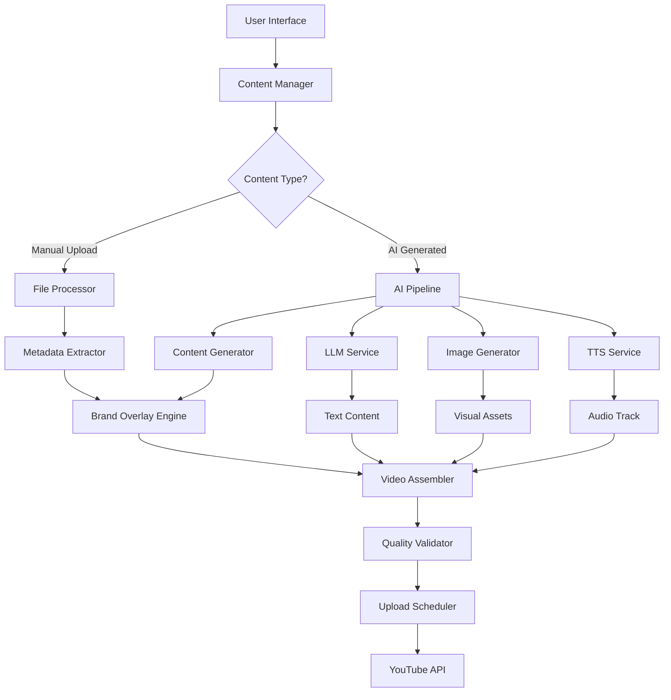

# YouTube Automation Enhancement: AI Video Generation & Manual Upload System

## Executive Summary

This document outlines the theoretical framework for enhancing your YouTube automation platform with AI-powered video generation, manual upload capabilities, and automated content creation features using exclusively open-source technologies.

## System Architecture Overview

```
┌─────────────────┐    ┌──────────────────┐    ┌─────────────────┐
│   User Input    │───▶│  Content Engine  │───▶│  Video Pipeline │
│                 │    │                  │    │                 │
│ • Topic/Domain  │    │ • Text Gen (LLM) │    │ • Image Gen     │
│ • Style/Brand   │    │ • Image Gen      │    │ • Video Gen     │
│ • Manual Assets │    │ • Voice/Audio    │    │ • Assembly      │
└─────────────────┘    └──────────────────┘    └─────────────────┘
         │                       │                       │
         ▼                       ▼                       ▼
┌─────────────────┐    ┌──────────────────┐    ┌─────────────────┐
│  Manual Upload  │    │   AI Generation  │    │   Scheduling    │
│                 │    │                  │    │                 │
│ • File Select   │    │ • Auto Content   │    │ • Queue Mgmt    │
│ • Metadata Edit │    │ • Brand Overlay  │    │ • Time Slots    │
│ • Preview       │    │ • Text-to-Video  │    │ • Auto Upload   │
└─────────────────┘    └──────────────────┘    └─────────────────┘
```

## Core Feature Requirements

### 1. Enhanced Content Generation System

#### Current State Analysis
- **Working**: Basic AI text generation for titles/descriptions
- **Missing**: Video generation, image processing, brand integration
- **Gap**: No visual content creation pipeline

#### Proposed Enhancement Architecture
```
Content Generation Pipeline:
┌─────────────┐    ┌─────────────┐    ┌─────────────┐    ┌─────────────┐
│ Text Gen    │───▶│ Image Gen   │───▶│ Video Gen   │───▶│ Final Video │
│ (LLM)       │    │ (Diffusion) │    │ (Assembly)  │    │ (Upload)    │
│             │    │             │    │             │    │             │
│ • Titles    │    │ • Visuals   │    │ • Slideshow │    │ • Metadata  │
│ • Scripts   │    │ • Brand     │    │ • Transitions│    │ • Scheduling│
│ • Tags      │    │ • Products  │    │ • Audio     │    │ • Analytics │
└─────────────┘    └─────────────┘    └─────────────┘    └─────────────┘
```

### 2. Manual Upload Enhancement

#### Data Flow Diagram
```
User Interface
     │
     ▼
┌─────────────────────────────────┐
│        Upload Form              │
│ ┌─────────────────────────────┐ │
│ │ Video File/URL Selection    │ │
│ │ Title (AI Generated/Manual) │ │
│ │ Description (AI/Manual)     │ │
│ │ Tags (AI Suggested)         │ │
│ │ Thumbnail (AI/Upload)       │ │
│ │ Schedule Options            │ │
│ └─────────────────────────────┘ │
└─────────────────────────────────┘
     │
     ▼
┌─────────────────────────────────┐
│      Validation Engine          │
│ • File Format Check            │
│ • Duration Validation          │
│ • Brand Guidelines            │
│ • SEO Optimization            │
└─────────────────────────────────┘
     │
     ▼
┌─────────────────────────────────┐
│       Processing Queue          │
│ • Immediate Upload             │
│ • Scheduled Upload             │
│ • Batch Processing             │
└─────────────────────────────────┘
```

## Open Source AI Technologies Stack

### 1. Large Language Models (LLMs)

#### Text Generation Options
- **Ollama**: Local LLM hosting
  - Models: Llama 2, CodeLlama, Mistral
  - Deployment: Self-hosted, no API limits
  - Use case: Content generation, script writing

- **Hugging Face Transformers**: 
  - Models: FLAN-T5, GPT-J, Bloom
  - Deployment: Local inference or HF Spaces
  - Use case: Title optimization, tag generation

#### Implementation Flow
```
User Input (Topic: "LLM Agents") 
    │
    ▼
┌─────────────────────────────────┐
│          LLM Processing         │
│                                 │
│ Prompt Engineering:             │
│ "Create YouTube Short content   │
│  about {topic} for {audience}   │
│  in {style} format"             │
│                                 │
│ Model Selection:                │
│ • Llama 2 7B (General)         │
│ • Mistral 7B (Technical)       │
│ • CodeLlama (Programming)       │
└─────────────────────────────────┘
    │
    ▼
Generated Output:
• Title: "AI Agents in 60 Seconds"
• Script: Hook + Content + CTA
• Tags: [ai, agents, tutorial]
• SEO Description
```

### 2. Image Generation Systems

#### Stable Diffusion Pipeline
```
Text Prompt → Stable Diffusion → Base Image → Brand Overlay → Final Image
     │              │                │              │             │
     │              │                │              │             ▼
  "Create        Model            Raw           Brand        Product
   product       Inference       Image         Logo +       Image
   showcase"                                   Text
```

#### Open Source Options
- **Stable Diffusion XL**: High-quality image generation
- **ControlNet**: Precise image control and composition
- **IP-Adapter**: Style consistency across images
- **InstructPix2Pix**: Image editing via text instructions

#### Brand Integration Workflow
```
Base Image Generation
         │
         ▼
┌─────────────────────────────────┐
│     Brand Overlay System        │
│                                 │
│ Elements to Add:                │
│ • Company Logo (watermark)      │
│ • Product Name (overlay text)   │
│ • Price Information             │
│ • Call-to-Action                │
│ • Social Media Handles          │
└─────────────────────────────────┘
         │
         ▼
Final Branded Image
```

### 3. Video Generation Technologies

#### Image-to-Video Conversion
- **AnimateDiff**: Convert static images to short videos
- **Runway Gen-2 (Open Source Alternative)**: ModelScope
- **SVD (Stable Video Diffusion)**: Meta's video generation

#### Video Assembly Pipeline
```
Image Sequence Generation:
Image 1 (Hook) → Image 2 (Content) → Image 3 (CTA)
     │                │                   │
     ▼                ▼                   ▼
┌─────────────────────────────────────────────┐
│           Video Assembly Engine             │
│                                             │
│ Components:                                 │
│ • Transition Effects (fade, slide, zoom)   │
│ • Text Overlays (animated titles)          │
│ • Audio Track (TTS or music)               │
│ • Duration Control (15s, 30s, 60s)         │
│ • Aspect Ratio (9:16 for Shorts)           │
└─────────────────────────────────────────────┘
     │
     ▼
Final MP4 Video (YouTube Ready)
```

### 4. Text-to-Speech Integration

#### Open Source TTS Options
- **Coqui TTS**: Multi-language, voice cloning
- **eSpeak-NG**: Lightweight, multilingual
- **Festival**: Classic TTS system
- **Mozilla TTS**: High-quality neural TTS

#### Audio Pipeline
```
Script Text → TTS Model → Audio File → Video Sync → Final Video
     │           │           │           │            │
     │           │           │           │            ▼
"In this      Voice        WAV/MP3    Timeline     MP4 with
 video..."    Synthesis     Audio      Matching     Narration
```

## Feature Implementation Strategy

### Phase 1: Manual Upload Enhancement

#### Requirements Analysis
```
Current Upload Flow Issues:
• Limited metadata editing
• No preview functionality  
• Missing scheduling options
• No brand integration

Enhanced Upload Flow:
┌─────────────────────────────────┐
│        Upload Interface         │
│                                 │
│ 1. File Selection              │
│    • Drag & Drop               │
│    • URL Import                │
│    • Cloud Storage Link        │
│                                 │
│ 2. AI Content Generation       │
│    • Auto-title suggestion     │
│    • Description optimization  │
│    • Tag recommendations       │
│    • Thumbnail generation      │
│                                 │
│ 3. Manual Override Options     │
│    • Edit all AI suggestions   │
│    • Custom thumbnail upload   │
│    • Brand guideline check     │
│                                 │
│ 4. Preview & Validation        │
│    • Video preview player      │
│    • Metadata preview          │
│    • SEO score analysis        │
│                                 │
│ 5. Publishing Options          │
│    • Immediate upload          │
│    • Schedule for later        │
│    • Add to automation queue   │
└─────────────────────────────────┘
```

### Phase 2: AI Video Generation

#### Slideshow Generation System
```
Input Sources:
┌─────────────────┐    ┌─────────────────┐    ┌─────────────────┐
│  Manual Images  │    │  AI Generated   │    │   Brand Assets  │
│                 │    │     Images      │    │                 │
│ • User uploads  │    │ • Product shots │    │ • Logo files    │
│ • Stock photos  │    │ • Backgrounds   │    │ • Color scheme  │
│ • Screenshots   │    │ • Graphics      │    │ • Fonts         │
└─────────────────┘    └─────────────────┘    └─────────────────┘
         │                       │                       │
         ▼                       ▼                       ▼
┌─────────────────────────────────────────────────────────────┐
│                Slideshow Engine                             │
│                                                             │
│ Processing Steps:                                           │
│ 1. Image preprocessing (resize, optimize)                   │
│ 2. Brand overlay application                                │
│ 3. Text overlay generation (product info)                   │
│ 4. Transition effect selection                              │
│ 5. Audio track synchronization                              │
│ 6. Export optimization (YouTube format)                     │
└─────────────────────────────────────────────────────────────┘
         │
         ▼
YouTube-Ready Video File
```

#### Product Information Integration
```
User Input:
• Product Name: "AI Learning Kit"
• Price: "$99"  
• Key Benefit: "Learn AI in 30 Days"

Brand Template System:
┌─────────────────────────────────┐
│         Slide Templates         │
│                                 │
│ Template 1: Product Showcase    │
│ ┌─────────────────────────────┐ │
│ │ [Product Image]             │ │
│ │ Product Name: Large Text    │ │
│ │ Price: Highlighted          │ │
│ │ Logo: Corner placement      │ │
│ └─────────────────────────────┘ │
│                                 │
│ Template 2: Benefit Focus       │
│ ┌─────────────────────────────┐ │
│ │ [Benefit Visual]            │ │
│ │ "Learn AI in 30 Days"       │ │
│ │ Call-to-Action Button       │ │
│ │ Social Media Handle         │ │
│ └─────────────────────────────┘ │
└─────────────────────────────────┘
```

## Technical Architecture Diagrams

### System Integration Flow



### Data Flow Architecture

```
┌─────────────────────────────────────────────────────────────┐
│                     Input Layer                             │
│ ┌─────────────┐ ┌─────────────┐ ┌─────────────┐             │
│ │ User Files  │ │ Text Prompts│ │ Brand Data  │             │
│ └─────────────┘ └─────────────┘ └─────────────┘             │
└─────────────────────────────────────────────────────────────┘
                              │
                              ▼
┌─────────────────────────────────────────────────────────────┐
│                  Processing Layer                           │
│                                                             │
│ ┌─────────────┐ ┌─────────────┐ ┌─────────────┐             │
│ │ LLM Engine  │ │ Stable      │ │ Video       │             │
│ │ (Ollama)    │ │ Diffusion   │ │ Assembly    │             │
│ │             │ │ (Local)     │ │ (FFmpeg)    │             │
│ │ • Content   │ │ • Images    │ │ • Editing   │             │
│ │ • Scripts   │ │ • Graphics  │ │ • Effects   │             │
│ │ • SEO       │ │ • Brands    │ │ • Audio     │             │
│ └─────────────┘ └─────────────┘ └─────────────┘             │
└─────────────────────────────────────────────────────────────┘
                              │
                              ▼
┌─────────────────────────────────────────────────────────────┐
│                   Output Layer                              │
│ ┌─────────────┐ ┌─────────────┐ ┌─────────────┐             │
│ │ Video Files │ │ Metadata    │ │ Scheduling  │             │
│ │ (MP4)       │ │ (JSON)      │ │ (Queue)     │             │
│ └─────────────┘ └─────────────┘ └─────────────┘             │
└─────────────────────────────────────────────────────────────┘
```

## Testing Strategy

### Manual Upload Testing Framework

```
Test Scenarios:
┌─────────────────────────────────────────────────────────────┐
│                    Test Case Matrix                         │
│                                                             │
│ 1. File Type Testing                                        │
│    • MP4 (various resolutions)                              │
│    • MOV, AVI conversion                                     │
│    • URL-based uploads                                       │
│                                                             │
│ 2. Content Generation Testing                               │
│    • AI title generation accuracy                           │
│    • Description SEO optimization                           │
│    • Tag relevance scoring                                  │
│                                                             │
│ 3. Brand Integration Testing                                │
│    • Logo overlay positioning                               │
│    • Color scheme consistency                               │
│    • Text readability checks                                │
│                                                             │
│ 4. Scheduling System Testing                                │
│    • Queue management                                       │
│    • Time zone handling                                     │
│    • Conflict resolution                                    │
└─────────────────────────────────────────────────────────────┘
```

### AI Generation Testing Protocol

```
Quality Assurance Framework:
┌─────────────────────────────────────────────────────────────┐
│                 AI Output Validation                        │
│                                                             │
│ Text Content Quality:                                       │
│ • Relevance Score (0-100)                                  │
│ • SEO Keyword Density                                      │
│ • Engagement Prediction                                     │
│                                                             │
│ Visual Content Quality:                                     │
│ • Image Resolution Standards                                │
│ • Brand Guideline Compliance                               │
│ • Aesthetic Appeal Rating                                  │
│                                                             │
│ Video Assembly Quality:                                     │
│ • Sync Accuracy (audio/video)                              │
│ • Transition Smoothness                                     │
│ • Overall Duration Precision                               │
└─────────────────────────────────────────────────────────────┘
```

## Open Source Technology Stack Summary

### Core Infrastructure
- **Backend**: FastAPI (Python)
- **Database**: MongoDB (document storage)
- **Queue System**: Redis/Celery
- **File Storage**: MinIO (S3-compatible)

### AI/ML Components
- **LLM Hosting**: Ollama + Llama2/Mistral
- **Image Generation**: Stable Diffusion XL
- **Video Processing**: FFmpeg + OpenCV
- **Text-to-Speech**: Coqui TTS
- **Model Management**: Hugging Face Hub

### Media Processing
- **Image Editing**: Pillow, OpenCV
- **Video Assembly**: MoviePy, FFmpeg
- **Audio Processing**: Pydub, Librosa
- **Format Conversion**: FFmpeg

### Deployment Options
- **Containerization**: Docker + Docker Compose
- **Orchestration**: Kubernetes (optional)
- **Monitoring**: Prometheus + Grafana
- **Logging**: ELK Stack (Elasticsearch, Logstash, Kibana)

## Cost Analysis & Scalability

### Resource Requirements
```
Development Environment:
• CPU: 16+ cores (for AI processing)
• RAM: 32GB+ (model loading)
• GPU: RTX 3080/4090 (optional, for faster inference)
• Storage: 1TB SSD (models + media files)

Production Scaling:
• Horizontal scaling with load balancers
• GPU clusters for AI processing
• CDN for media delivery
• Database sharding for user data
```

### Performance Optimization
```
Bottleneck Analysis:
┌─────────────────────────────────┐
│         Processing Times        │
│                                 │
│ Text Generation: 2-5 seconds    │
│ Image Generation: 10-30 seconds │
│ Video Assembly: 30-60 seconds   │
│ Upload Processing: 60-120 sec   │
│                                 │
│ Optimization Strategies:        │
│ • Model quantization           │
│ • Batch processing             │
│ • Caching systems              │
│ • Async processing queues      │
└─────────────────────────────────┘
```

This comprehensive framework provides the theoretical foundation for implementing your enhanced YouTube automation system using entirely open-source technologies, with no dependency on paid services or trial-based AI platforms.


Core Features Covered:
Manual Upload Enhancement:

File selection with drag-and-drop interface
AI-generated metadata with manual override options
Preview functionality before upload
Scheduling and queue management
Brand guideline compliance checks

AI Video Generation Pipeline:

Text-to-image generation using Stable Diffusion
Image-to-video conversion with AnimateDiff/SVD
Slideshow creation from multiple images
Brand overlay system (logo, product name, price)
Audio narration using open-source TTS

Open Source Technology Stack:

LLM: Ollama with Llama2/Mistral for content generation
Image Generation: Stable Diffusion XL + ControlNet
Video Processing: FFmpeg + MoviePy for assembly
TTS: Coqui TTS for voice generation
Infrastructure: FastAPI + MongoDB + Redis

Key Testing Scenarios:
For your current setup, you can test:

Content Generation: The AI is already working - test different topics like "AI Agents", "Machine Learning", "Automation Tools"
Manual Upload Flow: Test with actual video URLs and see how metadata gets populated
Brand Integration: Plan how to overlay your company info on generated visuals

Implementation Priority:
Phase 1: Enhance the existing manual upload with better metadata editing and preview
Phase 2: Add slideshow generation from images with brand overlays
Phase 3: Integrate full AI video pipeline with text-to-video generation
The document includes detailed system architecture diagrams, data flow charts, and technical specifications for implementing each component using exclusively open-source tools - no paid services or trial limitations.
All the technologies mentioned (Ollama, Stable Diffusion, FFmpeg, etc.) are completely free and can be self-hosted, giving you full control over the content generation pipeline.RetryClaude can make mistakes. Please double-check responses.Research Sonnet 4


